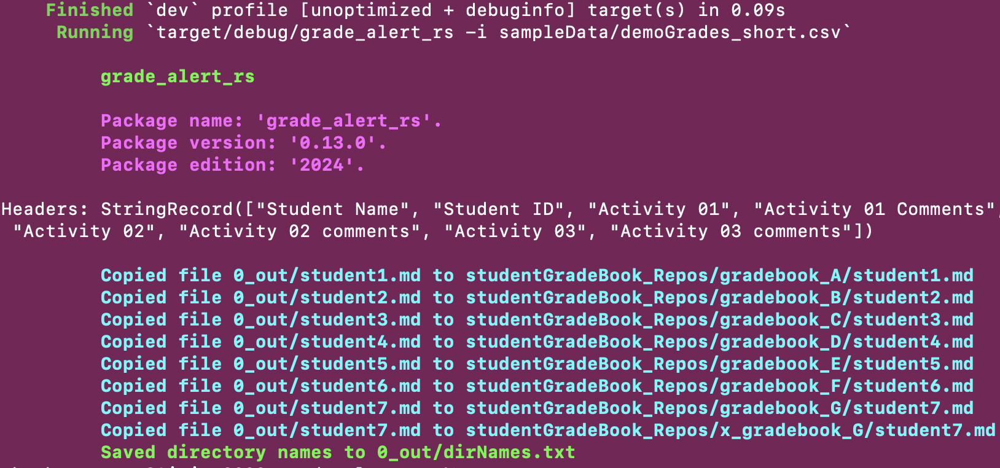

# __Grade_Alert_rs__: An automated tool written in Rust to help teachers by extracting student grade information from CSV files so that it can be conveniently diffused to members of a class

- Oliver Bonham-Carter, [Web](https://www.oliverbonhamcarter.com/)
- email: obonhamcarter@allegheny.edu
- Date: 24th April 2025


[](https://opensource.org/licenses/MIT)

[](https://blacklivesmatter.com/)

GitHub link: https://github.com/developmentAC/__Grade_Alert_rs__

## Table of contents
- [__Grade\_Alert\_rs__: An automated tool written in Rust to help teachers by extracting student grade information from CSV files so that it can be conveniently diffused to members of a class](#grade_alert_rs-an-automated-tool-written-in-rust-to-help-teachers-by-extracting-student-grade-information-from-csv-files-so-that-it-can-be-conveniently-diffused-to-members-of-a-class)
  - [Table of contents](#table-of-contents)
  - [Overview](#overview)
  - [Tool](#tool)
    - [Usage](#usage)
    - [Grade book repositories](#grade-book-repositories)
    - [CSV](#csv)
    - [Outputted files](#outputted-files)
    - [Placing Gradebook Files](#placing-gradebook-files)
          - [Usage](#usage-1)
          - [Output](#output)
    - [DirNames](#dirnames)
    - [Pushing in Bulk](#pushing-in-bulk)
    - [Structure](#structure)
    - [A work in progress](#a-work-in-progress)

## Overview
GitHub Classroom is an excellent resource to handle work repositories for a course of many students. Each student, after "accepting" an assignment is issued a unique repository in which work can be completed and pushed to the instructor.

Here, we suggest that GitHub Classroom be used to report grades to each student who has a grade book "assignment" repository. The instructor, who has access to this repository, places a file containing grades and feedback into this repository for the student to consult. With a little setup and configuration, __Grade_Alert_rs__ can place each gradebook file into its corresponding repository. This step saves the user from having to remember which file goes into what repository. All parts of this project have been written to run in Linux or MacOS operating systems. If you are using Windows, then parts of the project (such as file copying) may not work as expected.

## Tool

All grades in a course are kept in a CSV spreadsheet. __Grade_Alert_rs__ parses each row of the  spreadsheet and all contents are formatted and placed into a separate markdown file which is named according to the first column of the spreadsheet. These files are then to be placed into grade book repositories (discussed below) and pushed for the student to access.

### Usage

The [Rust programming language](https://www.rust-lang.org/) is necessary to compile the code of this project to run.

To process the sample CSV spreadsheet, `samples/demoGrades_short.csv` (files formats are discussed below), the following command must be used;

  `cargo run -- -i sampleData/demoGrades_short.csv`. 

Note: if there is a particular pairings file to be used to indicate which files are to be placed into what repositories, then the command to use this file is the following.

``` bash
cargo run -- -i sampleData/demoGrades_short.csv --pairings pairings.txt`
```

This command will create a directory called `0_out/` and place the markdown files into this directory. The files are named according to the first column of the CSV file. For example, the file for `student1` will be called `student1_gradebook.md`.


### Grade book repositories

GradeAlert works to copy grade book reports which are parsed from the grade spreadsheet, and place them into the GitHub repositories of students where they are to be pushed out for the student to access. The instructor must have access to the repositories which may be created by GitHub Classroom. 

We note here that these repositories are created by the instructor using GitHub Classroom to make an empty assignment. When a student "accepts" the "assignment", by clicking on the URL from GitHub Classroom, they are essentially creating a copy of the empty repository. The instructor is then able to access this repository and place files into it.

It is recommended that a script be used to pull all repositories for the student members of the class.

Assume that the ssh URLs for cloning grade book repository from GitHub are the following; 

``` text
git@github.com:CMPSC-305-Allegheny-College-Fall-2023/grade-book-student1.git
git@github.com:CMPSC-305-Allegheny-College-Fall-2023/grade-book-student2.git
git@github.com:CMPSC-305-Allegheny-College-Fall-2023/grade-book-student3.git
git@github.com:CMPSC-305-Allegheny-College-Fall-2023/grade-book-student4.git
```

Place each `git clone` on each line and then create a batch file, `repoBuilder.sh`, to automate the cloning process of these repositories. The instructor will need these repositories to place the grade book files into.

A sample `repoBuilder.sh` takes the following form.

``` text
git clone git@github.com:CMPSC-305-Allegheny-College-Fall-2023/grade-book-student1.git
git clone git@github.com:CMPSC-305-Allegheny-College-Fall-2023/grade-book-student2.git
git clone git@github.com:CMPSC-305-Allegheny-College-Fall-2023/grade-book-student3.git
git clone git@github.com:CMPSC-305-Allegheny-College-Fall-2023/grade-book-student4.git

mkdir student_repos
mv grade-book* student_repos/
```

Note that there is a bash line to move all cloned repositories into a created directory called `student_repos`.

### CSV

To use this __Grade_Alert_rs__, the student grades are to be kept in a comma separated variable (CSV) file.
Please note that no commas may be used in the fields of the CSV file as they will serve to confuse
the true delimiters of the CSV structure and will prevent __Grade_Alert_rs__ from opening the CSV files correctly.

In a grade book spreadsheet, each row contains the grades of the individuals in the course. The columns
header provide details of the assignment and type of feedback. The first column **must** contain the
name of the student; this information will be used to name the outputted files and serve to inform
which output file corresponds with what grade book repository. The rest of the information for a
row will be formatted and placed into the outputted file. The CSV formatting for a grade book CSV
files is shown below in the table.

|Student Name|	Student ID|	Activity 01|	Activity 01 Comments|	Activity 02|	Activity 02 comments|
|---|---|---|---|---|---|
|student1|	x0001|	100|	All requirements satisfied|	100|	excellent|
|student2|	x0002|	100|	Excellent|	100|	excellent|
|student3|	x0003|	100|	Excellent|	100|	excellent|
|student4|	x0004|	0|	Nothing submitted|	95|	excellent|
|student5|	x0005|	100|	Excellent|	95|	ok|
|student6|	x0006|	100|	Excellent|	100|	excellent|
|student7|	x0007|	0|	Nothing submitted|	0|	nothing submitted?|

### Outputted files

After running the __Grade_Alert_rs__ tool on a CSV file containing the information of the above
table, a file for each row is outputted. For example, the report of `student1` will take
the following form.


File: `student1_gradebook.md`

``` text
Student Name : student1

Student ID : x0001

Activity 01 : 100

Activity 01 Comments : All requirements satisfied

Activity 02 : 100

Activity 02 comments : excellent

____

```

Each prepared file is then to be placed into its associated grade book repository and is pushed out for the student.

### Placing Gradebook Files

The user can have __Grade_Alert_rs__ copy the gradebook markdown files into their associated repositories for bulk pushing (discussed below).

###### Usage

`cargo run -- -i sampleData/demoGrades_short.csv`


 For this step, the File `pairings.txt` must be in the local directory as the project. The pairing file lists the files (*left*) separated by a comma, and the repositories  (*right*) into which the file is to be copied before pushing. Shown below are the contents
 of `pairings.txt` for the accompanying gradebook spreadsheet example.

``` text
student1_gradebook.md,student_repos/grade-book-student1/
student2_gradebook.md,student_repos/grade-book-student2/
student3_gradebook.md,student_repos/grade-book-student3/
student4_gradebook.md,student_repos/grade-book-student4/
student5_gradebook.md,student_repos/grade-book-student5/
student6_gradebook.md,student_repos/grade-book-student6/
student7_gradebook.md,student_repos/grade-book-student7/
```

###### Output
The output for the command `cargo run -- -i sampleData/demoGrades_short.csv` is shown below.


### DirNames

Note that a new file, `0_out/dirNames.txt` will be created from this copying operation, shown below.

``` text
student_repos/grade-book-student1/
student_repos/grade-book-student2/
student_repos/grade-book-student3/
student_repos/grade-book-student4/
student_repos/grade-book-student5/
student_repos/grade-book-student6/
student_repos/grade-book-student7/
```

The File `dirNames.txt` is created in the `0_out/` directory and is to be moved to the root directory
where the `bulkPusher.sh` script is located so that this bash script can push each student repository to GitHub. This file contains the paths of the repositories to which we push.

### Pushing in Bulk

Each student who has accepted the grade book "assignment" will have a repository that the instructor
an access. Once the grade reports have been automaticall posted, the grade book repositories may now be pushed by the instructor using the below `bulkPusher.sh` script.

```bash
# Bulk Pusher script.
# Date: 21 September 2025
# Oliver Bonham-Carter, obonhamcarter@allegheny.edu
# This script uses the File, dirNames.txt, to locate repositories to push
# The current date is printed in the commit message of the submit
# A file, "0_thisLastPush.txt" is created to state when the last bulk push was completed.


NOW=`date`
printf "Current date and time in Linux is: $NOW"

date > 0_thisLastPush.txt

pwd > mydir
for z in `cat mydir`; do cd $z; done

# If the dirNames.txt is not in the directory 0_out/
# for DIRNAME in $(cat dirNames.txt)

for DIRNAME in $(cat 0_out/dirNames.txt)
do
    cd $DIRNAME
    echo Checking: $DIRNAME
    git add -A
    git commit -m "Grade update: $NOW"
    git push
    cd $z/
done

rm mydir
```

In a convenient setup, the repositories, the files `dirNames.txt` and `bulkPusher.sh` are to stored
in root directory. The structure of the file system is discussed below.

### Structure

The files are to be arranged in the following way for a typical usage. Note, this arrangement
shows the demonstration files.

```
(grade_alert_rs project files)
 
./0_out/
  - dirNames.txt (this may need to be placed in the root directory)
  student1_gradebook.md
  student2_gradebook.md
  student3_gradebook.md
  student4_gradebook.md
  student5_gradebook.md
  student6_gradebook.md
  student7_gradebook.md

./student_repos/
  grade-book-student1/
  grade-book-student2/
  grade-book-student3/
  grade-book-student4/
  grade-book-student5/
  grade-book-student6/
  grade-book-student7/
   
./
./bulkPusher.sh
./demoGrades_short.csv
./pairings.txt
```

*Note: As the user uses __Grade_Alert_rs__ to handle gradebook repositories and markdown files, having
the files in the above order will help to simplify the commands to use them.*

### A work in progress

Check back often to see the evolution of this project!! __Grade_Alert_rs__ is a work-in-progress.
Updates are likely to come soon with feedback. If you would like to contribute to this project,
__then please do!__ For instance, if you see some low-hanging fruit or task that you could easily
complete, that could add value to the project, then I would love to have your insight.

Otherwise, please create an Issue for bugs or errors. Since I am a teaching faculty member at
Allegheny College, I may not have all the time necessary to quickly fix the bugs and so I would be
very happy to have any help that I can get from the OpenSource community for any technological
insight. Much thanks in advance. I hope that this project helps you to conveniently publish your course grades. 

If you appreciate this project and would like to follow it, then please consider clicking the project's _Star_ button. 
:-)
